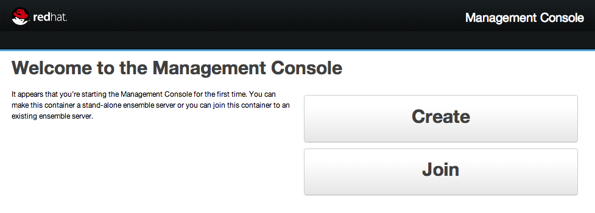
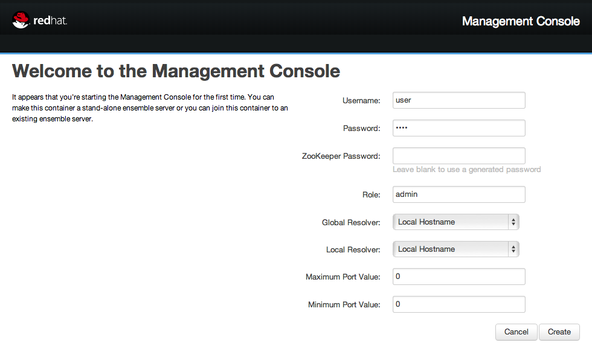
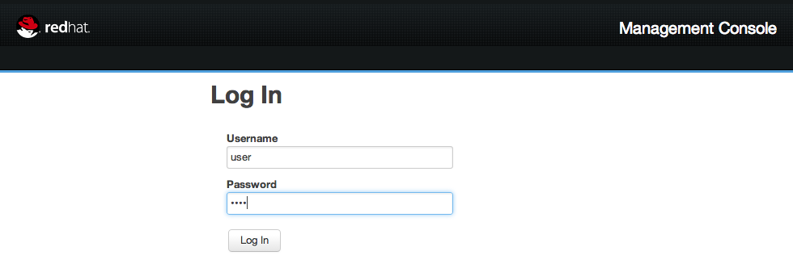
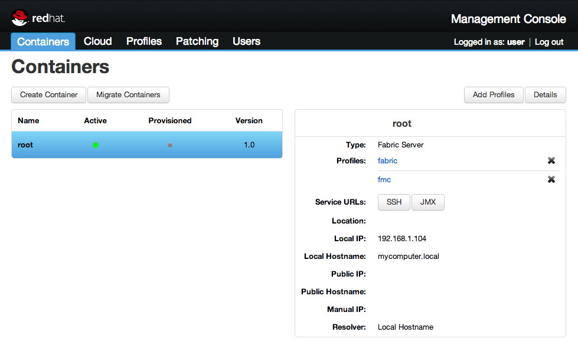
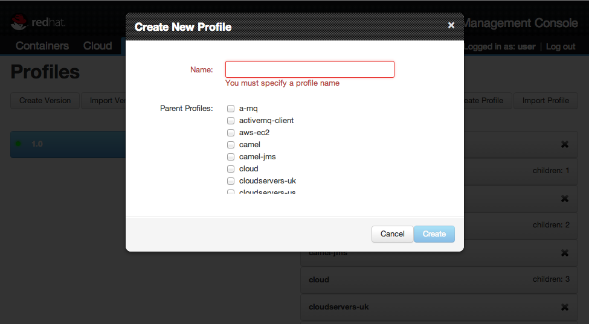
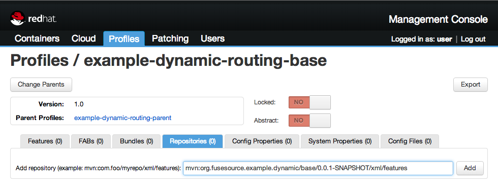
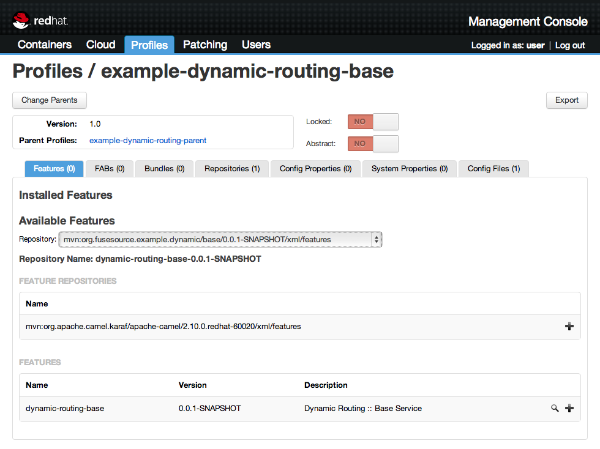
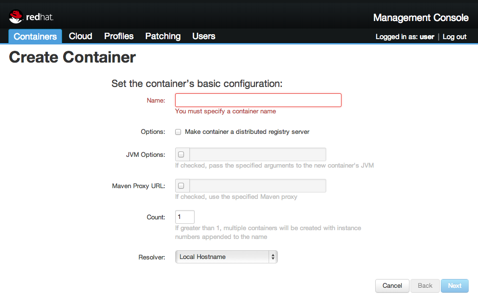
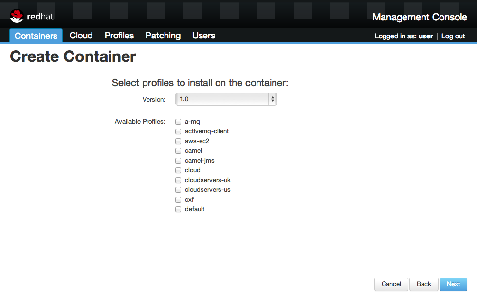

# Camel and JBoss Fuse Dynamic Routing Example

## Managing a Deployment using Fuse Fabric

### Overview

[Fuse Fabric][] is a runtime environment that leverages capabilities of [Apache Karaf][], the container underlying JBoss
Fuse, to provide centralized configuration and provisioning capabilities. In brief, [Fuse Fabric][]
provides the ability to create container instances running locally or remotely, including on cloud environments like
Amazon EC2 and Rackspace. You can then create and apply Profiles that define what OSGi bundles and associated
configurations (name / value pairs) to apply to each managed container.

Management Console provides a web-based user interface to make it easier to interact with Fuse Fabric than
Fabric’s provided command-line interface.

### Setup and Testing

To start the management console, install the `fabric-webui` feature from the Fuse console.

    features:install fabric-webui

Once the server has started, open a web browser and go to <http://localhost:8181/>.

Click the `Create` button if this is your first time running and configure a `Username` and `Password` and an optional `ZooKeeper Password`
for the ensemble server. Since we're only going to use the local system to host our containers, you can skip the other fields.

Click the `Create` button and log in with your brand new credentials

Once you're logged in you can see the tab-bar at the top, the list of containers on the left and some container information on the right.

### Create Profiles

*Profiles* have an inheritance concept where parent profile’s configuration and bundles are applied fully before the
child profiles. It is a good practice to create parent profiles for common configurations shared across your
applications. Using parent profiles can also help ensure dependent bundles are fully deployed **before** child profile
bundles. To be clear, Fuse Fabric only has a single concept called *Profile*, and they act as parent or child purely
based on their relationship to other profiles, that is when you create a profile you can specify zero of more other
profiles (which may also have parent profiles) to be the parent of the profile you are creating.

For the purposes of this example, we will create a single parent profile called `example-dynamic-routing-parent` that
will be shared (parent profile of) the 2 service profiles: `example-dynamic-routing-base` and
`example-dynamic-routing-newservice`.

Select the `Profiles` tab, and push the `Create Profile` button on upper right. You will be prompted to enter a name,
and select zero or more Parent Profiles.

Follow the details below to create the three target Profiles:

Name: `example-dynamic-routing-parent`  
Parent Profiles: `camel` and `karaf`  

Name: `example-dynamic-routing-base`  
Parent Profiles: `example-dynamic-routing-parent`  

Name: `example-dynamic-routing-newservice`  
Parent Profiles: `example-dynamic-routing-parent`  

To edit the `example-dynamic-routing-base` settings, select the profile from the profiles list in the profiles tab.
Head to the `Repositories` tab and add the `mvn:org.fusesource.example.dynamic/base/0.0.1-SNAPSHOT/xml/features`
repository.

Browse to the `Features` tab and select the repository you just added. The `dynamic-routing-base` feature will appear
at the bottom. Add this feature by clicking the `+` button on the right.

Repeat this for the `example-dynamic-routing-newservice` profile. Add the
`mvn:org.fusesource.example.dynamic/newservice/0.0.1-SNAPSHOT/xml/features` repository so you can add the
`dynamic-routing-newservice` feature.

### Creating Container

Fuse Fabric allows you to create managed Containers to which you can deploy one or more profiles. A managed
Container is initially a minimal [Apache Karaf][] instance with a Fuse Fabric agent bundle deployed. For this example,
we will create a single Container that we will first deploy the Base service to, test it, and then deploy Newservice,
and test both.

Select the `Containers` tab, and press the `Create Container` button. You will be prompted to enter a name (e.g.
`Dynamic-Routing`). 

Press `Next` in the lower right. You will then be prompted to select the zero or more Profiles to
initial provision the container with. Select `example-dynamic-routing-base`, and press `Next`. 

At th next form leave the defaults for now, and press `Next` and then `Finish`.

At this point, it will create a new Container instance, and initially provision it with our example-dynamic-routing-base
Profile (i.e. deploy the Base service OSGi bundle). You can verify that it is running correctly by, from a separate
Command Prompt, running the test client : `mvn -Psimple` and `mvn -Pother`. In the upper right of the Container tab, you
can select the `Detail` button to see more information on the deployed Container, including drilling into seeing the
deployed Camel routes.

To deploy newservice, push the `Add Profiles` button with your created Container, and add
`example-dynamic-routing-newservice`. This will provision the newservice bundle to the running Container, and you can
verify that it is running by trying the test client `mvn -Pnewservice`

[Apache Karaf]: http://karaf.apache.org
[Fuse Fabric]: http://fuse.fusesource.org/fabric/index