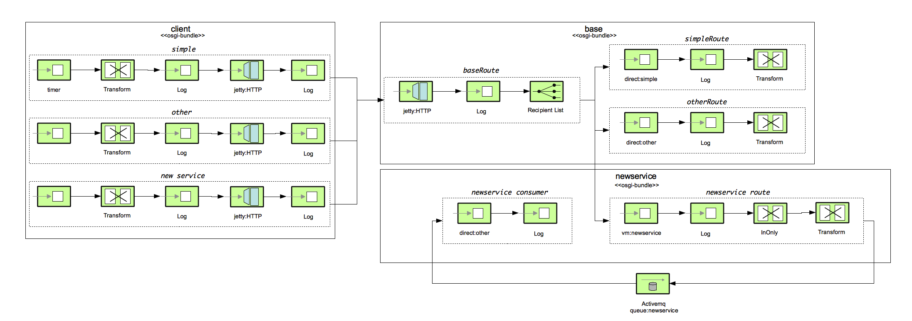

# Camel and JBoss Fuse Dynamic Routing Example

If you want to deploy ths example using fabric, please follow the instructions described in 
the [Managing a Deployment using Fuse Fabric](Fabric.md) guide.

## Overview

This example shows how to use [Apache Camel][], and its OSGi integration to dynamically route messages to new or updated
OSGi bundles within [JBoss Fuse][]. This allows you to route to newly deployed services **at runtime** without impacting
running services.

This example combines use of the Camel [Recipient List][], which allows you to at runtime specify the [Camel Endpoint][]
to route to, and use of the [Camel VM][] Component, which provides a [SEDA][] queue that can be accessed from different
OSGi bundles running in the same Java virtual machine.

Note: Extra steps, like use of Camel VM Component, need to be taken when accessing Camel Routes in different Camel
Contexts, and in different OSGi bundles, as you are dealing with classes in different ClassLoaders...

The example further is explained by the following EIP diagram:

### Alternative Approaches

Instead of using [Camel VM][] Component, use of [ActiveMQ Camel][] Component would also work. You'd need to configure a
single ActiveMQ broker instance that all Camel routes can reference. To optimize performance, if the ActiveMQ broker
runs embedded within JBoss Fuse, then you can use ActiveMQ's [VM Transport][], which is conceptually similar to Camel's VM
Component in that it effectively uses direct method calls to enhance message transfer to and from the ActiveMQ Broker
within a single Java Virtual Machine. This approach *may* be slightly less efficient than using the [Camel VM][]
approach, but use of ActiveMQ would allow to easily horizontally scale out multiple Fuse instances.

You could also use the [Camel NMR][] Component, which leverages JBoss Fuse / Apache [ServiceMix NMR][] component. This
provides a way to reference named endpoints across OSGi bundles. The issue with this approach is that the NMR within
JBoss Fuse / ServiceMix is loosing favor within the Apache ServiceMix community, and may be deprecated in the not to
distant future.

At the end of this ReadMe is a section describing how to management a deployment of this example using [Fuse Fabric][]
and Management Console.

---

### Requirements:

* JBoss Fuse 6.3.0 or later (https://access.redhat.com/jbossnetwork - registration required)
* Maven 3.2.3 or newer (http://maven.apache.org/)
* Java SE 7 or Java SE 8

### Notes:

* In JBoss Fuse, make sure that you've added a admin/admin userid and password to
 `<JBoss Fuse Home>/etc/users.properties`, or update the included Camel route to the userid and
 password you have defined for the JBoss Fuse embedded ActiveMQ.

---

## Building and Running

To build this project use [Apache Maven][] in the base directory of this project

    mvn install

This example will be deploying into [JBoss Fuse][]. Follow the instructions to download, and install your own copy.

Below are a sequence of steps that highlight the core concepts:

1. Install the activemq-blueprint feature
2. Install Base Service
3. Test Base Service
4. Deploy Newservice Service
5. Test Base Service now able to route to both existing and new

### 1. Install the activemq-blueprint feature

    features:addUrl mvn:org.apache.activemq/activemq-karaf/5.11.0.redhat-630187/xml/features
    features:install activemq-blueprint

### 2. Install Base Service

Within the Base Camel route there are 3 routes:

* an HTTP listener that routes to other endpoints based on the contents of the request
* a “simple” route that responds with a “Simple Response: {body of message}”
* a “other” route that responds with a “Other Response: {body of message}”

Start JBoss Fuse, by running the included start script

    <JBoss Fuse Home>/bin/fuse

In the JBoss Fuse console, do the following

    features:addurl mvn:org.fusesource.example.dynamic/features/0.0.1-SNAPSHOT/xml/features
    features:install dynamic-routing-base

### 3. Testing Base Service

Then in a different Command Prompt, change to the `client` sub-project, and run

    mvn -Psimple

You should see log entries in both JBoss Fuse console, and the Command Prompt that messages are flowing to the Simple Route

    18:37:45,126 | INFO  | qtp317981251-233 | Base                             | 139 - org.apache.camel.camel-core - 2.17.0.redhat-630187 | Processing: direct:simple
    18:37:45,127 | INFO  | qtp317981251-233 | Simple                           | 139 - org.apache.camel.camel-core - 2.17.0.redhat-630187 | Processing: direct:simple
    18:37:46,043 | INFO  | qtp317981251-232 | Base                             | 139 - org.apache.camel.camel-core - 2.17.0.redhat-630187 | Processing: direct:simple
    18:37:46,043 | INFO  | qtp317981251-232 | Simple                           | 139 - org.apache.camel.camel-core - 2.17.0.redhat-630187 | Processing: direct:simple

You can also try the Other route to see that the recipient list is working correctly within the Base service

    mvn -Pother

with the following log output

    18:39:59,483 | INFO  | qtp317981251-232 | Base                             | 139 - org.apache.camel.camel-core - 2.17.0.redhat-630187 | Processing: direct:other
    18:39:59,484 | INFO  | qtp317981251-232 | Other                            | 139 - org.apache.camel.camel-core - 2.17.0.redhat-630187 | Processing: direct:other
    18:40:00,399 | INFO  | qtp317981251-235 | Base                             | 139 - org.apache.camel.camel-core - 2.17.0.redhat-630187 | Processing: direct:other
    18:40:00,400 | INFO  | qtp317981251-235 | Other                            | 139 - org.apache.camel.camel-core - 2.17.0.redhat-630187 | Processing: direct:other

### 4. Deploying Newservice Service

In the JBoss Fuse console, do the following

    features:install dynamic-routing-newservice

### 5. Testing Newservice Service

Then in a different Command Prompt, change to the `client` sub-project, and run

    mvn -Pnewservice

You should see log entries in both JBoss Fuse console, and the Command Prompt that messages are flowing to the New Service
Route

    18:41:51,479 | INFO  | qtp317981251-233 | Base                             | 139 - org.apache.camel.camel-core - 2.17.0.redhat-630187 | Processing: vm:newservice
    18:41:51,480 | INFO  |  vm://newservice | newservice-route                 | 139 - org.apache.camel.camel-core - 2.17.0.redhat-630187 | Message: vm:newservice
    18:41:51,489 | INFO  | umer[newservice] | newservice-consumer              | 139 - org.apache.camel.camel-core - 2.17.0.redhat-630187 | Consumer: vm:newservice
    18:41:52,394 | INFO  | qtp317981251-232 | Base                             | 139 - org.apache.camel.camel-core - 2.17.0.redhat-630187 | Processing: vm:newservice
    18:41:52,396 | INFO  |  vm://newservice | newservice-route                 | 139 - org.apache.camel.camel-core - 2.17.0.redhat-630187 | Message: vm:newservice
    18:41:52,399 | INFO  | umer[newservice] | newservice-consumer              | 139 - org.apache.camel.camel-core - 2.17.0.redhat-630187 | Consumer: vm:newservice

Notice that the original Base service did not reload or restart to start forwarding messages to the newly loaded routes.
You can re-run the original tests against `mvn -Psimple` and `mvn -Pother` to see that those still work correctly.

Newservice grabs the messages from the Camel VM component, and puts them onto (and off of) an ActiveMQ Queue. This shows
how to route to new endpoints and integration routes at runtime -- it does not have to be ActiveMQ, it could easily be
WS, REST, other JMS (Tibco, WMQ), etc.

[Apache Camel]: http://camel.apache.org
[Apache Karaf]: http://karaf.apache.org
[Apache Maven]: http://maven.apache.org
[ActiveMQ Camel]: http://camel.apache.org/activemq.html
[Camel Endpoint]: http://camel.apache.org/endpoint.html
[Camel NMR]: http://camel.apache.org/nmr
[Camel VM]: http://camel.apache.org/vm.html
[JBoss Fuse]: https://www.redhat.com/products/jbossenterprisemiddleware/fuse/
[Fuse Fabric]: http://fuse.fusesource.org/fabric/index
[Recipient List]: http://camel.apache.org/recipient-list.html
[SEDA]: http://www.eecs.harvard.edu/~mdw/proj/seda/
[VM Transport]: http://activemq.apache.org/vm-transport-reference.html
